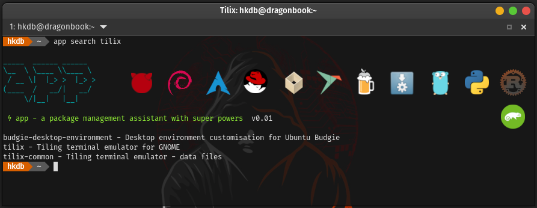

# app - A Package Management Assistant with Super Powers 
maintained by: @hkdb




### SUMMARY

A Unified Package Management Experience for users who either want a reproduceable workstation build or simply handle a lot of machines with ease.

App is a cross-platform package management wrapper written in Go that remembers all the additional packages a user installs on a machine beyond the base installation so that all the same packages can be automatically reinstalled on another machine with one command. It also provides the same command line interface across different distros/OS's and package managers so you don't have to remember the various syntax across different OS's and package managers. Last but not least, it allows users to upgrade all software packages installed on a system with a user defined set of package managers (ex. apt, flatpak, and AppImage) via a single command.

Supported OS:
- Linux 
- Mac (Homebrew)
- FreeBSD
- Windows [coming soon]

Supported Package Managers:
- apt
- dnf
- pacman
- yay
- pkg
- zypper
- Flatpak
- Snap
- Homebrew
- AppImage
- go
- pip
- cargo
- And more coming soon! (See `SUPPORT & ROADMAP` section)

This fun project came to life because I have multiple machines and am constantly re-installing them. I also review and or get new laptops fairly often.

<b>THIS IS STILL ALPHA SOFTWARE</b>

Skip all the mumbo jumbo if you just want to see how to [INSTALL](docs/INSTALL.md) and [UPGRADE](docs/UPGRADE.md) app.

### BACKGROUND (Probably TL;DR for most)

[>>> Why app was created...](docs/BACKGROUND.md)


### HOW IT WORKS

Instead of using your package manager, you use the app command to install/remove packages so that it records everything inside `~/.config/app`. So when you move that directory to a new machine of the same based distro or OS, you can just install all the packages you have installed on the old machine with one command. In fact, if you move your `~/.config` directory on a Linux machine to the next, it should retain most of your app settings that reside in `~/.config` as well but be aware of config structual changes between varying versions of the same software. 

See [APP CONFIG DIRECTORY STRUCTURE](docs/STRUCTURE.md) to learn more about what's inside `~/.config/app`.

See the [available options (flags)](docs/USAGE.md) of app.

See [USAGE EXAMPLES](docs/EXAMPLES.md) to see a more complete dive into how to use app.


### IN ACTION

[](https://asciinema.org/a/YmpvOaXS2dviXXOIPM7EppyKf)


### INSTALL

Run the below command in the terminal:

```
curl -sL https://hkdb.github.io/app/getapp.sh | bash
```

You can also install app by compiling yourself:

1. Make sure all the package managers you want app to manage and are installed and configured properly
2. Install `git` manually if it's not already installed
3. cd into a directory of choice where you want to keep the app repo. If you are an end user and can't decide, I suggest `~/.config` (`mkdir ~/.config` if it doesn't already exist)
4. git clone https://github.com/hkdb/app.git`
5. `cd app`
6. Optionally `git checkout <version>`
7. `./install.sh` # Note, for FreeBSD, bash must first be installed.


### UPDATE/UPGRADE

Run the below command in the terminal:

```
app -m app update
```

You can also update app by compiling it yourself:

Tracking versioned release:

1. cd back into the repo whereever you put it. `~/.config/app` if you took my recommendation 
2. `git pull`
3. `git checkout <version tag>`
3. `./update.sh` # FreeBSD requires bash to be installed

Tracking main branch:

1. cd back into the repo whreever you put it. `~/.config/app` if you took my recommendation 
2. `git pull`
3. `./update.sh` # FreeBSD requires bash to be installed


### SUPPORT & ROADMAP

- GNU/Linux (apt, dnf, pacman, flatpak, snap, brew, appimage)
  - Debian derivatives
    - Debian, Ubuntu, Pop, MX, Kali, Raspbian, LinuxMint   
  - Redhat derivatives
    - Fedora, RHEL, Rocky, CentOS, Oracle, ClearOS, AmazonAMI
  - Arch derivatives
    - Arch, Manjaro, Garuda, Endeavour
  - Suse derivatives
    - OpenSUSE Leap
    - SLES
- macOS (brew)
- Go
- Python (pip)
- Rust (cargo)
- FreeBSD (pkg)

Currently in the roadmap:

- Windows (scoop)
- Windows (chocolatey)

`Pre-requisites`:

Curl and Unzip must be installed

There's an install script that comes with this repo which is the preferred way to install app. However, I leave having each of your package managers proper setup/configuration to the end user before running app. For example, if you don't have the right packages installed to have add-apt-repository work properly on Debian or flatpak can't be used without sudo, then app will inevitably fail.

See the below notes on package manager setup:
- [flatpak](docs/FLATPAK.md)
- [go](docs/GO.md)
- [pip](docs/PIP.md)
- [cargo](docs/CARGO.md)

If there are enabled package managers that you absolutely hate and want out of the auto restore/install all loop, you can disable them manually (ie. `app -m snap disable`) and app will remember this whereever you bring your `~/.config/app` directory. You can also re-enable them anytime by just running `app -m <package manager> enable`

`Other distros`:

Some distros are easily supported by just simply identifying them under each of the 3 base distros respectively so if there's a distro that it doesn't support already, feel free to submit an issue including the output of `cat /etc/*-release` to request for it to be added and I will try to find time to get it added on.

Also, I primarily use Pop, Ubuntu, Debian, Fedora, Arch, and Garuda so other distros are a bit less tested. If you notice any issues on the other "supported" distros, please let me know by submitting an issue here.

The native package manager of immutable distros and distros like nixos will most likely never make it to this list since for example, nixos' declarative package management pretty much addresses the same problem but just in a different way and perhaps maybe even better...

`Caveat`: Arch Derivatives

add-repo and rm-repo actions for Arch based distros only take bash scripts as arguments and only for pacman (not yay). There are various reasons why. Among them all, perhaps the more important ones are:

- The concept of AUR repos are largestly different than the traditional distros and Arch has AUR helpers like yay that simplfies everything already so there's really no point for this feature to be in app. However, I did make this action a scriptable input in case there are certain things you want to automate prior to doing a restore all. I don't recommend using this feature unless you really know what you are doing though.
- Users in Arch often don't have to add that many AURs. So it's not necessarily worth the time to automate this.
- Yay is already a wrapper that does a great job with pretty much all that you need out-of-the-box, beyond tracking the packages users install with it, along with the above reasons, there's really no point in having add-repo and rm-repo for yay.

app does not handle local packages for Arch based distros as most of the time, users in Arch that deal with local packages are compiling their own packages from source which is sort of out of scope for what app is trying to solve. Unless someone tells me I am wrong, there aren't really pre-compiled packages out there that you can't really get from a combination of pacman, Arch AUR, and Chaotic. If someone tells me that they have a use case that says otherwise, it's most likely involving only 1 or 2 packages or some very specific dev project related subset which again, makes this feature fall under "not worth the time to automate" and "out of scope".

`Caveat`: Snap

As far as I know, there's no way to easily add third party repos especially since the whole backend is closed source.

`Caveat`: AppImage

If your AppImage app updates itself, you may need to manually edit your .desktop file in `$HOME/.local/share/applications/` to point to the correct AppImage file in `$HOME/.config/app/packages/local/appimage/` since the new file has a new version on the file name.

`go/pip/cargo`:

The go, pip, and cargo support is not meant to be a replacement for development purposes but rather for users that use software that are distributed via go, pip, and cargo. 


### SUPPORT US!

If this repo was useful to you, feel free to buy us some coffee! :)

[](https://www.buymeacoffee.com/3dfosi)


### VERSIONS

#### v0.25

- Changed single installation command to be more universal
- Fixed fish shell support
- Added aarch64 support [#22](https://github.com/hkdb/app/issues/22)
- Added reminder for enable/disable synatax errors [#23](https://github.com/hkdb/app/issues/23)


#### v0.24

- Fixed restoration of .sh added repositories


#### v0.23

- Really fixed mac self update...


#### v0.22

- Fixed mac self update


#### v0.21

- Fixed regression of brew not working in Linux derived from v0.19 changes


#### v0.20

- Fixed dnf update error handling [#13](https://github.com/hkdb/app/issues/13)


#### v0.19

- Fixed install/update scripts for M1/2/3 macs [#15](https://github.com/hkdb/app/issues/15)
- Fixed environment config for macs
- Added fullpath for brew including specific path for Apple Silicon


#### v0.18

- Fixed FreeBSD & Mac path regression


#### v0.17

- Added nixos support so that app can be used to handle Flatpak, Snap, Go, Pip, and Cargo if desired.
- Note: `whereis` must be installed on nixos for this to work.


#### v0.16

- Really fixed cargo command check this time... v0.15 didn't do the trick
- Fixed distro support regression identified by @AnonJervis specifically making LinuxMint work again


#### v0.15

- Fixed cargo command check to include $HOME/.cargo/bin/cargo so that it handles non-package-manager installed cargo properly


#### v0.14

- Fixed install.sh, update.sh, getapp.sh, updateapp.sh for Suse
- Added show OS during install and `app -m app update`


#### v0.13

- Fixed FreeBSD native package manager check logic
- Fixed updateapp.sh for Mac and FreeBSD


#### v0.12

- Fixed .app_profile logic in getapp.sh
- Aligned UX between binary (getapp.sh/updateapp.sh) and compile (install.sh and update.sh) installation
- Removed redundant header from `app -m app update`
- Added latest version check to `app -m app update` so that it doesn't update when not needed 
- Added copy button and latest release version to site


#### v0.11

- Changed bash scripts headers to allow for ./ execution on FreeBSD
- Added Update script for easy installation with less dependencies
- Implemented self-update `app -m app update`

- Launched https://hkdb.github.io/app


#### v0.10

- Added autoremove to Flatpak - Thanks to @RichardFevrier
- Fixed AppImage default enable/disable value
- Added check to ensure native package manager specified is running on the right distro
- Added SUSE derivatives support


#### v0.09

- Fixed brew and flatpak restore - Thanks to @RichardFevrier
- Fixed default enabled values to avoid errors on first launch - Thanks to @RichardFevrier
- Output history in alphabetical order by default and allow users to use the -raw flag to output history in the order packages were installed
- Fixed -y behavior for flatpak

- Development Feature: Added pre-commit linter - Thanks to @RicherFevrier
- Development Feature: Auto-compile binaries on release in preparation for better distribution/installation solution - Thanks to @RicherFevrier


#### v0.08

- Fixed FreeBSD handling of go, pip, and cargo
- Removed lsb_release dependancy - Special thanks to @RichardFevrier for this valuable pull request!
- Added update to pacman and yay
- Minor clean up of pacman and yay code


#### v0.07

- Added FreeBSD support
- Added LinuxMint support
- Fixed Fedora installation
- Added update action for Redhat derivatives
- Cleaned-up settings handling


#### v0.06

- Fixed flatpak and apt list to support keyword searches better.


#### v0.05 - Feb 10th, 2024

- Fixed .desktop file handler to avoid unintended read errors for AppImage installation


#### v0.04 - Feb 1st, 2024

- Allow for debian packages with a . in the name (ie. containerd.io or docker.io)
- Added go/pip/cargo to dist-upgrade all for Debian based distros
- Fixed UrlCheck to allow for installing cargo packages with short package names
- Updated `app help` to reflect go, pip, and cargo


#### v0.03 - Jan 17th, 2024

- Minor fixes
- Added go, pip, and cargo support


#### v0.02 - Jan 10th, 2024

- Added Homebrew & macOS support
- Fixed `app settings`

If you are upgrading rather than installing for the first time on Linux, after upgrading to this version, execute the following command:
```
echo "BREW = n" >> ~/.config/app/settings.conf
```

#### v0.01 - Jan 6th, 2024

- First Alpha Release


### DISCLAIMER

THIS IS STILL ALPHA SOFTWARE

This repo is sponsored by 3DF OSI and is maintained by volunteers. 3DF Limited, 3DF OSI, and its volunteers in no way make any guarantees. Please use at your own risk!

To Learn more, please visit:

https://osi.3df.io

https://3df.io
