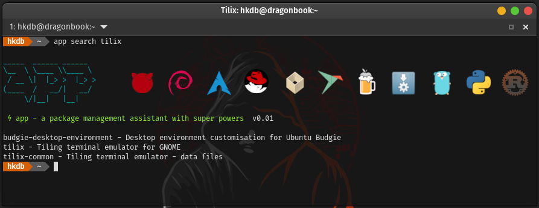
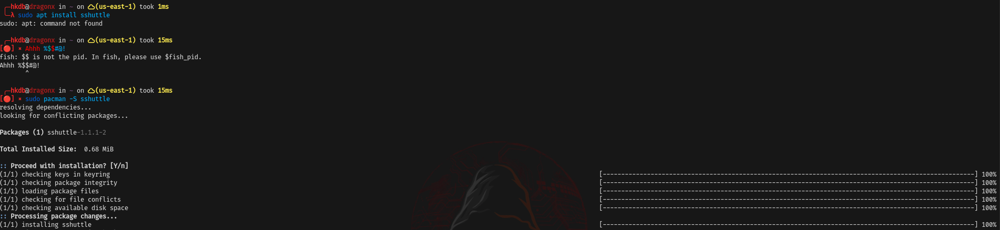

# app - A Package Management Assistant with Super Powers 
maintained by: @hkdb




### SUMMARY

A Unified Package Management Experience for users who either want a reproduceable workstation build or simply handle a lot of machines with ease.

App is a cross-platform package management wrapper written in Go that remembers all the additional packages a user installs on a machine beyond the base installation so that all the same packages can be automatically reinstalled on another machine with one command. It also provides the same command line interface across different distros/OS's and package managers so you don't have to remember the various syntax across different OS's and package managers. Last but not least, it allows users to upgrade all software packages installed on a system with a user defined set of package managers (ex. apt, flatpak, and AppImage) via a single command.

Supported OS:
- Linux 
- Mac (Homebrew)
- FreeBSD
- Windows [coming soon]

Supported Package Managers:
- apt
- dnf
- pacman
- yay
- pkg
- Flatpak
- Snap
- Homebrew
- AppImage
- go
- pip
- cargo
- And more coming soon! (See `SUPPORT & ROADMAP` section)

This fun project came to life because I have multiple machines and am constantly re-installing them. I also review and or get new laptops fairly often.

Skip all the mumbo jumbo if you just want to see how to [INSTALL](docs/INSTALL.md) and [UPGRADE](docs/UPGRADE.md) app.


### BACKGROUND (Probably TL;DR for most)

`If you found this repo via Medium, skip to the next section (HOW IT WORKS).`

So I personally have a considerable amount of machines. My team and I also deal with a lot of machines at work. When I get a new machine or want to repurpose an existing machine, I prefer to do fresh installs rather than imaging hard drives because among other reasons, imaging carries all the junk/cache over beyond just configs/preferences and it's not only a pain to maintain but also undesirable to keep a big number of images around on storage. Furthermore, handling image change is very time consuming. Plus, I mean, there's something to be said about a clean install if you know what I mean. 

Sure you can carry over just the home directory minus your .cache directory which mostly takes care of the junk and cache but how will you get all the same software installed that your home directory references? And yes, you can see what you manually installed with each package manager on your older computer running Debian based distros if you just do a little googling and then ninja your way through the output to derive long lines of packages to install manually on the new machine but God forbid you are on a rpm based system… I am not even aware of a way to see what was manually installed. I guess back to googling? What about Macs and Windows which I often use Homebrew and Scoop on?

Sometimes, I also need to use a different distro and more often than not, the distro at hand is still based on 1 of the 3 grandfathers (Debian, Redhat, Arch). It's also not necessarily always feasible to maintain an ansible playbook since often times, people forget they even installed something new while they were in the heat of their workflow. So on your next computer, you go through that whole troubleshooting journey again just to end up fixing the same problem by installing the same missing library manually.

How about package management standardization? Unless you are a purist which I am not dismissing the fact that purists do exist, chances are, you use the native package manager where you can and Flatpak just because your favorite software's developer doesn't want to deal with cross-distro hell and maybe even *evil music*… snap for certain server side packages that work better or are just easier to setup with snap.

Last but not least, it's only natural that I get slowed down during work because I accidentally typed `sudo apt install` on an Arch based distro and then having to Ctrl-C half way through it to finally type `sudo pacman -S` just so something trivial is installed. I wonder how many hours this type of incident collectively took in my 20+ years of IT. Sure it's just a second or 2 MAX each time but I am willing to bet that if I counted them every time, the number would end up significant.



And so......... out came this project that was born over some time off from work during the winter holidays in 2023. It aims to solve the problem by:

- Providing the same command structure across OS/distros and package managers to reduce the brain teasing task of remembering which command structure is for which package manager
- Automatically remember what repos you added and what packages you installed on each package manager
- Provide a single command upgrade of all the software across all package managers used
- Provide a way to allow for a single command install of everything you have ever installed on another computer if it's the same distro base or OS

This is more of a proof-of-concept(POC) from a week or two of "free time" hacking. It probably can use a considerable amount of refactoring. I also don't yet trust the flag checks and will be appreciative if anyone wants to do some testing and submit loopholes but it seems enough so-far to cover my personal silly mistakes.

In other words, yes, <b>THIS IS STILL ALPHA SOFTWARE</b>.


### HOW IT WORKS

Instead of using your package manager, you use the app command to install/remove packages so that it records everything inside `~/.config/app`. So when you move that directory to a new machine of the same based distro or OS, you can just install all the packages you have installed on the old machine with one command. In fact, if you move your `~/.config` directory on a Linux machine to the next, it should retain most of your app settings that reside in `~/.config` as well but be aware of config structual changes between varying versions of the same software. 

See [APP CONFIG DIRECTORY STRUCTURE](docs/STRUCTURE.md) to learn more about what's inside `~/.config/app`.

See the [available options (flags)](docs/USAGE.md) of app.

See [USAGE EXAMPLES](docs/EXAMPLES.md) to see a more complete dive into how to use app.


### IN ACTION

[](https://asciinema.org/a/YmpvOaXS2dviXXOIPM7EppyKf)


### SUPPORT & ROADMAP

- GNU/Linux (apt, dnf, pacman, flatpak, snap, brew, appimage)
  - Debian derivatives
    - Debian, Ubuntu, Pop, MX, Kali, Raspbian, LinuxMint   
  - Redhat derivatives
    - Fedora, RHEL, Rocky, CentOS, Oracle, ClearOS, AmazonAMI
  - Arch derivatives
    - Arch, Manjaro, Garuda, Endeavour
- macOS (brew)
- Go
- Python (pip)
- Rust (cargo)
- FreeBSD (pkg)

Currently in the roadmap:

- Suse Based Linux
- Windows (scoop)
- Windows (chocolatey)

`Pre-requisites`:

There's an install script that comes with this repo which is the preferred way to install app. It takes care of most of the immediate dependencies but I leave having each of your package managers proper setup/configuration to the end user before running app. For example, if you don't have the right packages installed to have add-apt-repository work properly on Debian or flatpak can't be used without sudo, then app will inevitably fail. I am however open to installing or auto-configuring more dependencies in the future if this ends up being used by others and that's something that everyone wants.

See the below notes on package manager setup:
- flatpak (COMING SOON)
- go (COMING SOON)
- pip (COMING SOON)
- cargo (COMING SOON)

If there are enabled package managers that you absolutely hate and want out of the auto restore/install all loop, you can disable them manually (ie. `app -m snap disable`) and app will remember this whereever you bring your `~/.config/app` directory. You can also re-enable them anytime by just running `app -m <package manager> enable`

`Other distros`:

Some distros are easily supported by just simply identifying them under each of the 3 base distros respectively so if there's a distro that it doesn't support already, feel free to submit an issue including the output of `cat /etc/*-release` to request for it to be added and I will try to find time to get it added on.

Also, I primarily use Pop, Ubuntu, Debian, Fedora, Arch, and Garuda so other distros are a bit less tested. If you notice any issues on the other "supported" distros, please let me know by submitting an issue here.

Immutable distros and distros like nixos will most likely never make it to this list since for example, nixos' package manager pretty much addresses the same problem but just in a different way and perhaps maybe even better...

`Caveat`: Arch Derivatives

add-repo and rm-repo actions for Arch based distros only take bash scripts as arguments and only for pacman (not yay). There are various reasons why. Among them all, perhaps the more important ones are:

- The concept of AUR repos are largestly different than the traditional distros and Arch has AUR helpers like yay that simplfies everything already so there's really no point for this feature to be in app. However, I did make this action a scriptable input in case there are certain things you want to automate prior to doing a restore all. I don't recommend using this feature unless you really know what you are doing though.
- Users in Arch often don't have to add that many AURs. So it's not necessarily worth the time to automate this.
- Yay is already a wrapper that does a great job with pretty much all that you need out-of-the-box, beyond tracking the packages users install with it, along with the above reasons, there's really no point in having add-repo and rm-repo for yay.

app does not handle local packages for Arch based distros as most of the time, users in Arch that deal with local packages are compiling their own packages from source which is sort of out of scope for what app is trying to solve. Unless someone tells me I am wrong, there aren't really pre-compiled packages out there that you can't really get from a combination of pacman, Arch AUR, and Chaotic. If someone tells me that they have a use case that says otherwise, it's most likely involving only 1 or 2 packages or some very specific dev project related subset which again, makes this feature fall under "not worth the time to automate" and "out of scope".

`Caveat`: Snap

As far as I know, there's no way to easily add third party repos especially since the whole backend is closed source.

`go/pip/cargo`:

The go, pip, and cargo support is not meant to be a replacement for development purposes but rather for users that use software that are distributed via go, pip, and cargo. 


### INSTALL

1. Make sure all the package managers you want app to manage and are installed and configured properly
2. Install `git` manually if it's not already installed
3. cd into a directory of choice where you want to keep the app repo. If you are an end user and can't decide, I suggest `~/.config` (`mkdir ~/.config` if it doesn't already exist)
4. `git clone https://github.com/hkdb/app.git`
5. `cd app`
6. `./install.sh` or if you are installing from BSD, run `bash install.sh`


### UPDATE/UPGRADE

Tracking versioned release:

1. cd back into the repo whereever you put it. `~/.config/app` if you took my recommendation 
2. `git pull`
3. `git checkout <version tag>`
3. `./update.sh` or if you are running FreeBSD, run `bash update.sh`

Tracking main branch:

1. cd back into the repo whreever you put it. `~/.config/app` if you took my recommendation 
2. `git pull`
3. `./update.sh` or if you are running FreeBSD, run `bash update.sh`

### SUPPORT US!

If this repo was useful to you, feel free to buy us some coffee! :)

[](https://www.buymeacoffee.com/3dfosi)


### VERSIONS

#### v0.07

- Added FreeBSD support
- Added LinuxMint support
- Fixed Fedora installation
- Added update action for Redhat derivatives
- Cleaned-up settings handling


#### v0.06

- Fixed flatpak and apt list to support keyword searches better.


#### v0.05 - Feb 10th, 2024

- Fixed .desktop file handler to avoid unintended read errors for AppImage installation


#### v0.04 - Feb 1st, 2024

- Allow for debian packages with a . in the name (ie. containerd.io or docker.io)
- Added go/pip/cargo to dist-upgrade all for Debian based distros
- Fixed UrlCheck to allow for installing cargo packages with short package names
- Updated `app help` to reflect go, pip, and cargo


#### v0.03 - Jan 17th, 2024

- Minor fixes
- Added go, pip, and cargo support


#### v0.02 - Jan 10th, 2024

- Added Homebrew & macOS support
- Fixed `app settings`

If you are upgrading rather than installing for the first time on Linux, after upgrading to this version, execute the following command:
```
echo "BREW = n" >> ~/.config/app/settings.conf
```

#### v0.01 - Jan 6th, 2024

- First Alpha Release


### CHANGE

- 05262024 - Added update and cleaned up pacman and yay
- 05262024 - Bumping dev version for @RichardFevrier's pull request
- 05232024 - Fixed FreeBSD handling of go, pip, and cargo
- 05162024 - Prepared v0.07 release
- 05162024 - Added update for fedora, added update before upgrade all for fedora and freebsd, and tweaked install script
- 05162024 - Fixed fedora install, clean-up settings handling, and added FreeBSD support
- 04022024 - Added LinuxMint support
- 02202024 - Fixed flatpak and apt list
- 02102024 - Update README for v0.05 release
- 02092024 - Fixed appimage .desktop bug
- 02012024 - Updated help
- 02012024 - Updated README for v0.04 release
- 02012024 - Fixed dist-upgrade
- 02012024 - Allow for debian packages with .
- 01312024 - Fixed url check for short package names
- 01172024 - Updated Install instructions
- 01172024 - Minor fixes & added go, pip, and cargo
- 01102024 - Added brew, mac support, & fixed settings
- 01042024 - Summary edit
- 01042024 - Updated summary of README
- 01042024 - Updated background of README
- 01032024 - Added upgrade examples in README
- 01032024 - Updated README
- 01022024 - Fixed flatpak remove
- 12312023 - Initial commit


### DISCLAIMER

THIS IS STILL ALPHA SOFTWARE

This repo is sponsored by 3DF OSI and is maintained by volunteers. 3DF Limited, 3DF OSI, and its volunteers in no way make any guarantees. Please use at your own risk!

To Learn more, please visit:

https://osi.3df.io

https://3df.io
