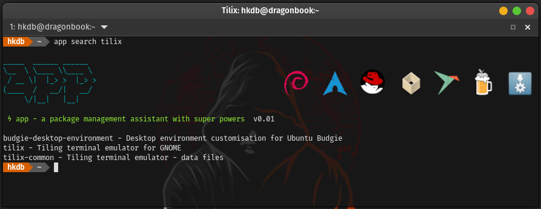
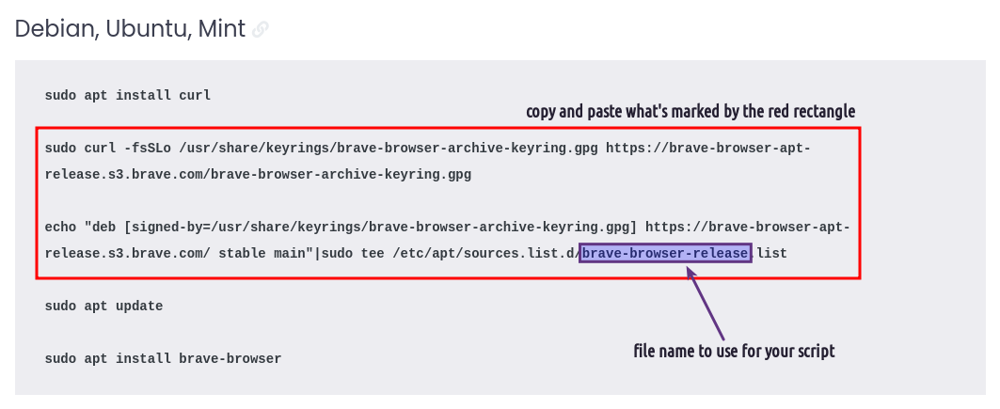
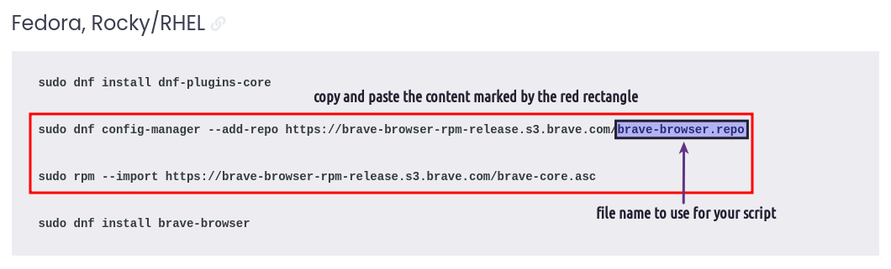
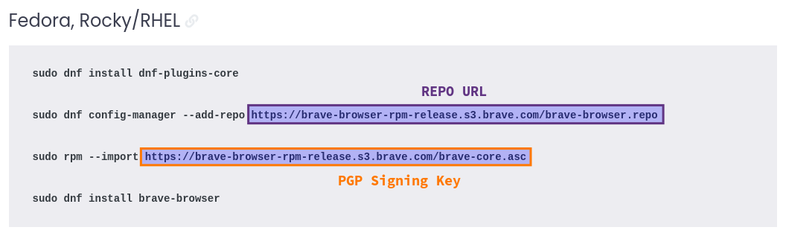

# app - A Package Management Assistant with Super Powers 
maintained by: @hkdb



### SUMMARY

A Unified Package Management Experience for users who handle a lot of machines.

App is a cross-platform package management wrapper written in Go that remembers all the additional packages a user installs on a machine beyond the base installation so that all the same packages can be automatically reinstalled on another machine with one command. It also provides the same command line interface across different distros/OS's and package managers so you don't have to remember the various syntax across different OS's and package managers. Last but not least, it allows users to upgrade all software packages installed on a system with a user defined set of package managers (ex. apt, flatpak, and AppImage) via a single command.

Supported OS:
- Linux 
- Mac (Homebrew) 
- Windows [coming soon]

Supported Package Managers:
- apt
- dnf
- pacman
- yay
- Flatpak
- Snap
- Homebrew
- AppImage
- And more coming soon! (See `SUPPORT & ROADMAP` section)

This fun project came to life because I have multiple machines and am constantly re-installing them. I also review and or get new laptops fairly often.

### BACKGROUND (Probably TL;DR for most)

`If you found this repo via Medium, skip to the next section (HOW IT WORKS).`

So I personally have a considerable amount of machines. My team and I also deal with a lot of machines at work. When I get a new machine or want to repurpose an existing machine, I prefer to do fresh installs rather than imaging hard drives because among other reasons, imaging carries all the junk/cache over beyond just configs/preferences and it's not only a pain to maintain but also undesirable to keep a big number of images around on storage. Plus, I mean, there's something to be said about a clean install if you know what I mean. 

Sure you can carry over just the home directory minus your .cache directory which mostly takes care of the junk and cache but how will you get all the same software installed that your home directory references? And yes, you can see what you manually installed with each package manager on your older computer running Debian based distros if you just do a little googling and then ninja your way through the output to derive long lines of packages to install manually on the new machine but God forbid you are on a rpm based system… I am not even aware of a way to see what was manually installed. I guess back to googling? What about Macs and Windows which I often use Homebrew and Scoop on?

Sometimes, I also need to use a different distro and more often than not, the distro at hand is still based on 1 of the 3 grandfathers (Debian, Redhat, Arch). It's also not necessarily always feasible to maintain an ansible playbook since often times, people forget they even installed something new while they were in the heat of their workflow. So on your next computer, you go through that whole troubleshooting journey again just to end up fixing the same problem by installing the same missing library manually.

How about package management standardization? Unless you are a purist which I am not dismissing the fact that purists do exist, chances are, you use the native package manager where you can and Flatpak just because your favorite software's developer doesn't want to deal with cross-distro hell and maybe even *evil music*… snap for certain server side packages that work better or are just easier to setup with snap.

Last but not least, it's only natural that I get slowed down during work because I accidentally typed "sudo apt install" on an Arch based distro and then having to Ctrl-C half way through it to finally type sudo pacman -S just so something trivial is installed. I wonder how many hours this type of incident collectively took in my 20+ years of IT. Sure it's just a second or 2 MAX each time but I am willing to bet that if I counted them every time, the number would end up significant.


And so......... out came this project that was born over some time off from work during the winter holidays in 2023. It aims to solve the problem by:

- Providing the same command structure across OS/distros and package managers to reduce the brain teasing task of remembering which command structure is for which package manager
- Automatically remember what repos you added and what packages you installed on each package manager
- Provide a single command upgrade of all the software across all package managers used
- Provide a way to allow for a single command install of everything you have ever installed on another computer if it's the same distro base or OS

This is more of a proof-of-concept(POC) from a week or two of "free time" hacking. It probably can use a considerable amount of refactoring. I also don't yet trust the flag checks and will be appreciative if anyone wants to do some testing and submit loopholes but it seems enough so-far to cover my personal silly mistakes.

In other words, yes, <b>THIS IS STILL ALPHA SOFTWARE</b>.

### HOW IT WORKS

Instead of using your package manager, you use the app command to install/remove packages so that it records everything inside `~/.config/app`. So when you move that directory to a new machine of the same based distro or OS, you can just install all the packages you have installed on the old machine with one command. In fact, if you move your `~/.config` directory on a Linux machine to the next, it should retain most of your app settings that reside in `~/.config` as well but be aware of config structual changes between varying versions of the same software. 

See the "APP CONFIG DIRECTORY STRUCTURE" section to learn more about what's inside ~/.config.

### USAGE EXAMPLE

By default, yay, flatpak, snap, and AppImage are disabled. You can enable whichever one you want one at a time:

```
app -m yay enable
app -m flatpak enable
app -m snap enable
app -m brew enable # If Linux. In Mac, it's default.
app -m appimage enable
```

if you regret it and say for example, just hate snap with a passion, you can disable it: 

```
app -m snap disable
```

To install software, instead of `sudo apt install neovim`, `flatpak install Geary`, and etc, you would execute:
```
app install neovim
app -m flatpak install Geary
app -m appimage install Densify-v0.3.1-x86_64.AppImage # from the directory where the .AppImage resides
app -m snap install spotify
app -m brew install gimp # In macOS, just "app install gimp" will do
```

If you need to install a piece of software in the form of a .deb or .rpm:

```
app install rustdesk-1.1.9.deb

# OR

app install jwhois-4.0-18.el6.x86_64.rpm
```

if you run into an issue of installing a snap that requires classic confinement like flow:
```
app -m snap -classic install flow
```
If you wanted to install the spotify from the `edge` channel instead, run the following command:
```
app -m snap -c edge install spotify
```

If you don't remember the package names or you just want to verify that they exist in the repos, you can always search for them per package managers:
```
app search tilix # apt, dnf, pacman
app -m yay search tilix
app -m flatpak search geary
app -m brew search gimp # or just "app search gimp" in macOS
app -m snap search spotify
```

All of the packages installed above will then be automatically added to a record that contains a space separated string of packages per package manager along with some other options and the local packages saved in various areas inside `~/.config/app` so that when the directory gets moved to a new machine, all you have to do on the new machine is:
```
app -r all
```
and all packages recorded/saved on your previous machine will be installed in the new machine.

Note* By default `app -r all` always starts with the native package manager first (ie. apt for Debian, dnf for Fedora, and pacman for Arch) and then moves down to flatpak, snaps, and AppImages. If you need to install out of order for your specific use case, you can always install all per package manager manually.

For Example:

```
app -r flatpak
app -r apt
app -r brew
app -r snap
app -r appimage
```

To see what has been installed by app before:
```
app history # apt, dnf, and pacman
app -m yay history
app -m flatpak history
app -m snap history
app -m brew history # or just "app history" in macOS
app -m appimage history
```

To see everything that was ever installed on the system:
```
app list # app, dnf, and pacman
app -m yay list
app -m flatpak list
app -m snap list
app -m brew list # or just "app list" in macOS
app -m appimage list
```

You can also search for what's installed on the system by including a search keyword:
```
app list neovim
app -m yay list neovim
app -m flatpak list geary
app -m snap list spotify
app -m brew list gimp # or just "app list gimp" in macOS
app -m appimage yubi
```

If you want to remove any software packages, you can use one of the following commands:

```
app remove neovim
app -m yay remove neovim
app -m flatpak remove org.gnome.Geary
app -m brew remove gimp # or just "app remove gimp" in macOS
app -m appimage remove Densify
app -m snap remove 'flow spotify'
```

for Debian based distros, you have an additional choice of:

```
app purge neovim
```

For any of the native package managers (apt, dnf, pacman), you can remove stale dependencies with:

```
app autoremove
```

To upgrade all installed packages:
```
app upgrade all
```

If you only want to update one package manager at a time manually:
```
app upgrade # apt, dnf, and pacman
app -m yay upgrade
app -m flatpak upgrade
app -m brew upgrade # or just "app upgrade" in macOS
app -m snap upgrade
```

If you use 3rd party repos for apt, dnf, or flatpak, no worries. They will be automatically restored from the restore command prior to package installation if you add them the following way:

#### EXAMPLE 1 ~ Official Graphics Driver PPA for Ubuntu

Debian based:

```
app add-repo ppa:graphics-drivers/ppa
```

#### EXAMPLE 2 ~ Let's use the Brave Browser for Example

#### Debian Based:


Create a script named `brave-browser-release.sh` according to the Brave website:



```
#!/bin/bash

sudo curl -fsSLo /usr/share/keyrings/brave-browser-archive-keyring.gpg https://brave-browser-apt-release.s3.brave.com/brave-browser-archive-keyring.gpg

echo "deb [signed-by=/usr/share/keyrings/brave-browser-archive-keyring.gpg, arch=amd64] https://brave-browser-apt-release.s3.brave.com/ stable main"|sudo tee /etc/apt/sources.list.d/brave-browser-release.list
```
Then add the repo with this script from within the same directory of the script:

```
app add-repo brave-browser-release.sh
```

#### Redhat Based:


You can do the same as above by making a script based on the instructions of the Brave browser website:



Create script:

```
#!/bin/bash

sudo dnf config-manager --add-repo https://brave-browser-rpm-release.s3.brave.com/brave-browser.repo

sudo rpm --import https://brave-browser-rpm-release.s3.brave.com/brave-core.asc
```

Add repo from within the directory where the script resides:

```
app add-repo brave-browser.repo.sh
```

OR

Use flags according to instructions provided by the Brave website:



with the following command:

```
app -gpg https://brave-browser-rpm-release.s3.brave.com/brave-core.asc add-repo https://brave-browser-rpm-release.s3.brave.com/brave-browser.repo 
```

#### EXAMPE 3 - Flatpak:

This one is by far the easiest. You just need the url. For example, if you wanted to add the Gnome nightly repo, run the following command:

```
app -m flatpak add-repo https://sdk.gnome.org/gnome-nightly.flatpakrep
```

#### EXAMPLE 4 - List Repos:

To see what repos you have added before, just run the following command:

```
app ls-repo # for APT or DNF

# OR

app -m flatpak ls-repo # for Flatpak
```

You can always search for an added repo by including a keyword after `app ls-repo` like this:

```
app ls-repo brave

# OR

app -m flatpak ls-repo geary
```

#### EXAMPLE 5 - Remove Repos:

Let's remove the Brave repo:

```
app rm-repo brave-browser-release # for APT

# OR

app rm-repo brave-browser.repo # for DNF
```
Let's remove the Gnome nightly repo from Flatpak:

```
app -m flatpak rm-repo gnome-nightly
```


### IN ACTION

[](https://asciinema.org/a/YmpvOaXS2dviXXOIPM7EppyKf)

### USAGE

```
USAGE:
	app [OPTIONS] <ACTION> <PACKAGE>
	EXAMPLE:
		app install neovim
		app -m flatpak install Geary

ACTIONS:
	- install ~ Install package. Takes package name as argument
	- remove ~ Uninstall package. Takes package name as argument
	- update ~ Refreshes repos
	- upgrade ~ Upgrade packages. Takes "all" as a value to upgrade with all package managers
	- dist-upgrade ~ A more advanced upgrade that can add or remove packages during upgrade (APT Only)
	- autoremove ~ Remove dependency packages that are no longer required
	- purge ~ Same as remove but removes configs too (APT only)
	- search ~ Search for packages in repos
	- list ~ List packages installed on system. Greps for package if argument is provided.
	- history ~ List pacakges installed by app. Takes package name as argument to search.
	- enable ~ Enable Package Manager (Flatpak, Snap, AppImage)
	- disable ~ Disable Package Manager (Flatpak, Snap, AppImage)
	- add-repo ~ Add package manager repo. Takes a .sh, ppa, or url as argument.
	- rm-repo ~ Remove package manager repo. Takes repo identifier as argument
	- ls-repo ~ List package manager repos
	- settings ~ List settings including the status of packages managers (enabled/disabled)

PACKAGE:
	Package name(s). For multiple packages, wrap the argument with quotes.
	EXAMPLE:
		app install 'neovim whois nmap'

OPTIONS:
  -c string
    	Channel - Used in combination with installing snap packages (SNAP Only)
    	   usage: app -m snap -c <channel> install vlc
    	   options:
    		- beta
    		- candidate
    		- edge
    		- stable
    	
  -classic
    	Classic Confinement for Snaps (SNAP Only)
    	   usage: app -m snap -classic install flow
    	
  -gpg string
    	PGP Key URL - Used in combination with a url arg for add-repo (DNF Only)
    	   usage: app -gpg <url> add-repo <url>
    	
  -m string
    	Package Manager
    	   usage: app -m <package manager> install neovim
    	   default: auto-detect of native pkg manager <apt/dnf/pacman>
    	   example: app -a install -p neovim
    	   options:
    		- apt (default if debian based)
    		- dnf (default if redhat based)
    		- pacman (default if arch based)
    		- yay
    		- flatpak
    		- snap
            - brew (default if macOS)
    		- appimage
    	
  -r string
    	Restore / Install all on new system
    	   usage: app -r <type>
    	   option:
    		- apt
    		- dnf
    		- pacman
    		- yay
    		- flatpak
    		- snap
            - brew
    		- appimage
    		- all
    	
  -y	Auto Yes - Skips the package manager confirmation (APT & DNF Only)
    	   usage: app -y install neovim
    	
```

### SUPPORT & ROADMAP

- GNU/Linux (apt, dnf, pacman, flatpak, snap, brew, appimage)
  - Debian derivatives
    - Debian, Ubuntu, Pop, MX, Kali, Raspbian   
  - Redhat derivatives
    - Fedora, RHEL, Rocky, CentOS, Oracle, ClearOS, AmazonAMI
  - Arch derivatives
    - Arch, Manjaro, Garuda, Endeavour
- macOS (brew)

Currently in the roadmap:

- Go
- Rust (cargo)
- Suse Based Linux
- Python (pip)
- Windows (scoop)
- Windows (chocolatey)

`Pre-requisites`:

There's an install script that comes with this repo which is the preferred way to install app. It takes care of most of the immediate dependencies but I leave having each of your package managers proper setup/configuration to the end user before running app. For example, if you don't have the right packages installed to have add-apt-repository work properly on Debian or flatpak can't be used without sudo, then app will inevitably fail. I am however open to installing or auto-configuring more dependencies in the future if this ends up being used by others and that's something that everyone wants.

If there are enabled package managers that you absolutely hate and want out of the auto restore/install all loop, you can disable them manually (ie. `app -m snap disable`) and app will remember this whereever you bring your `~/.config/app` directory. You can also re-enable them anytime by just running `app -m <package manager> enable`

`Other distros`:

Some distros are easily supported by just simply identifying them under each of the 3 base distros respectively so if there's a distro that it doesn't support already, feel free to submit an issue including the output of `lsb_release -a` to request for it to be added and I will try to find time to get it added on.

Also, I primarily use Pop, Ubuntu, Debian, Fedora, Arch, and Garuda so other distros are a bit less tested. If you notice any issues on the other "supported" distros, please let me know by submitting an issue here.

Immutable distros and distros like nixos will most likely never make it to this list since for example, nixos' package manager pretty much addresses the same problem but just in a different way and perhaps maybe even better...

`Caveat`: Arch Derivatives

add-repo and rm-repo actions for Arch based distros only take bash scripts as arguments and only for pacman (not yay). There are various reasons why. Among them all, perhaps the more important ones are:

- The concept of AUR repos are largestly different than the traditional distros and Arch has AUR helpers like yay that simplfies everything already so there's really no point for this feature to be in app. However, I did make this action a scriptable input in case there are certain things you want to automate prior to doing a restore all. I don't recommend using this feature unless you really know what you are doing though.
- Users in Arch often don't have to add that many AURs. So it's not necessarily worth the time to automate this.
- Yay is already a wrapper that does a great job with pretty much all that you need out-of-the-box, beyond tracking the packages users install with it, along with the above reasons, there's really no point in having add-repo and rm-repo for yay.

app does not handle local packages for Arch based distros as most of the time, users in Arch that deal with local packages are compiling their own packages from source which is sort of out of scope for what app is trying to solve. Unless someone tells me I am wrong, there aren't really pre-compiled packages out there that you can't really get from a combination of pacman, Arch AUR, and Chaotic. If someone tells me that they have a use case that says otherwise, it's most likely involving only 1 or 2 packages or some very specific dev project related subset which again, makes this feature fall under "not worth the time to automate" and "out of scope".

`Caveat`: Snap

As far as I know, there's no way to easily add third party repos especially since the whole backend is closed source.

### APP CONFIG DIRECTORY STRUCTURE

The config directory app creates on your machine has the following structure to "remember what you installed and removed". Some directories may not exist for you since they are not created until you install something with that specific package manager.

```
~/.config/app
      |_ settings.conf
      |_ packages
          |
          |_ appimage.json
          |
          |_ apt.json
          |
          |_ deb.json - a list of packages
          |
          |_ brew.json
          |
          |_ dnf.json
          |
          |_ flatpak.json
          |
          |_ pacman.json
          |
          |_ local
          |   |_ deb
          |   |   |_ <package name>.json
          |   |   |_ <package file name>.deb
          |   |   
          |   |_ rpm
          |   |   |_ <package name>.json
          |   |   |_ <package file name>.rpm
          |   |
          |   |_ appimage
          |       |_ <package name>.json>
          |       |_ <package name>
          |           |_ <package name>.AppImage
          |           |_ <package>.desktop
          |           |_ <package>.png
          |
          |_ repo
          |   |_ apt.json
          |   |_ dnf.json
          |   |_ pacman.json
          |   |_ yay.json
          |   |_ flatpak.json
          |   |_ Channel
          |   |   |_snap
          |   |      |_ <package name>.json
          |   |
          |   |_ local
          |       |_ apt
          |       |   |_ <repo name>.sh
          |       |
          |       |_ dnf
          |       |   |_ <repo name>.sh/json
          |       |       
          |       |_ pacman
          |       |   |_ <repo name>.sh
          |       |
          |       |_ flatpak
          |       |   |_ <repo name>.json
          |       |
          |       |_ snap
          |           |_ <package name>.json 
          |
          |
          |_ rpm.json
          |
          |_ snap.json
          |
          |_ yay.json
```

You can of course choose to work backwards and mannually edit/compose the data inside this directory but you better know what you are doing or something really wrong could happen. Be warned.... 

### INSTALL

1. Make sure all the package managers you want app to manage are installed and configured properly
2. Install git manually if it's not already installed
3. cd into a directory of choice where you want to keep the app repo. If you are an end user and can't decide, I suggest `~/.config` (`mkdir ~/.config` if it doesn't already exist)
4. `git clone https://github.com/hkdb/app.git`
5. `cd app`
6. `./install.sh`

### UPDATE/UPGRADE

Tracking versioned release:

1. cd back into the repo whereever you put it. `~/.config/app` if you took my recommendation 
2. `git pull`
3. `git checkout <version tag>`
3. `./update.sh`

Tracking main branch:

1. cd back into the repo whreever you put it. `~/.config/app` if you took my recommendation 
2. `git pull`
3. `./update.sh`

### SUPPORT US!

If this repo was useful to you, feel free to buy us some coffee! :)

[](https://www.buymeacoffee.com/3dfosi)


### VERSIONS

#### v0.02 - Jan 10th, 2024

Added Homebrew & macOS support

If you are upgrading rather than installing for the first time on Linux, after upgrading to this version, execute the following command:
```
echo "BREW = n" >> ~/.config/app/settings.conf
```

#### v0.01 - Jan 6th, 2024

First Alpha Release

### CHANGE

- 01102024 - Added brew, mac support, & fixed settings
- 01042024 - Summary edit
- 01042024 - Updated summary of README
- 01042024 - Updated background of README
- 01032024 - Added upgrade examples in README
- 01032024 - Updated README
- 01022024 - Fixed flatpak remove
- 12312023 - Initial commit

### DISCLAIMER

THIS IS STILL ALPHA SOFTWARE

This repo is sponsored by 3DF OSI and is maintained by volunteers. 3DF Limited, 3DF OSI, and its volunteers in no way make any guarantees. Please use at your own risk!

To Learn more, please visit:

https://osi.3df.io

https://3df.io
