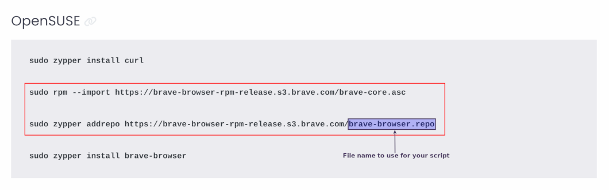
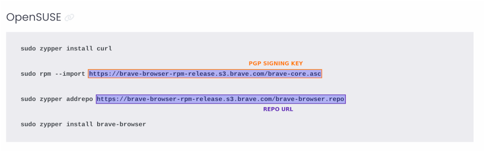

## USAGE EXAMPLE

By default, yay, flatpak, snap, AppImage, go, pip, and cargo are disabled. You can enable whichever one you want one at a time:

```
app -m yay enable
app -m flatpak enable
app -m snap enable
app -m brew enable # If Linux. In Mac, it's default.
app -m appimage enable
app -m go enable
app -m pip enable
app -m cargo enable
```

if you regret it and say for example, just hate snap with a passion, you can disable it: 

```
app -m snap disable
```

To install software, instead of `sudo apt install neovim`, `flatpak install Geary`, and etc, you would execute:
```
app install neovim
app -m flatpak install Geary
app -m appimage install Densify-v0.3.1-x86_64.AppImage # from the directory where the .AppImage resides
app -m snap install spotify
app -m brew install gimp # In macOS, just "app install gimp" will do
app -m go install github.com/charmbracelet/glow@latest
app -m pip install mdv
app -m cargo install fd
app -m cargo -tag 0.2.0 install https://github.com/donovanglover/hyprnome
```

If you need to install a piece of software in the form of a .deb or .rpm:

```
app install rustdesk-1.1.9.deb

# OR

app install jwhois-4.0-18.el6.x86_64.rpm
```

if you run into an issue of installing a snap that requires classic confinement like flow:
```
app -m snap -classic install flow
```
If you wanted to install the spotify from the `edge` channel instead, run the following command:
```
app -m snap -c edge install spotify
```

If you don't remember the package names or you just want to verify that they exist in the repos, you can always search for them per package managers:
```
app search tilix # apt, dnf, pacman
app -m yay search tilix
app -m flatpak search geary
app -m brew search gimp # or just "app search gimp" in macOS
app -m snap search spotify
app -m cargo search fd
```

All of the packages installed above will then be automatically added to a record that contains a space separated string of packages per package manager along with some other options and the local packages saved in various areas inside `~/.config/app` so that when the directory gets moved to a new machine, all you have to do on the new machine is:
```
app -r all
```
and all packages recorded/saved on your previous machine will be installed in the new machine.

Note* By default `app -r all` always starts with the native package manager first (ie. apt for Debian, dnf for Fedora, and pacman for Arch) and then moves down to flatpak, snaps, and AppImages. If you need to install out of order for your specific use case, you can always install all per package manager manually.

For Example:

```
app -r flatpak
app -r apt
app -r brew
app -r snap
app -r appimage
app -r go
app -r pip
app -r cargo
```

To see what has been installed by app before:
```
app history # apt, dnf, and pacman
app -m yay history
app -m flatpak history
app -m snap history
app -m brew history # or just "app history" in macOS
app -m appimage history
app -m go history
app -m pip history
app -m cargo history
```

To see everything that was ever installed on the system:
```
app list # app, dnf, and pacman
app -m yay list
app -m flatpak list
app -m snap list
app -m brew list # or just "app list" in macOS
app -m appimage list
app -m go list
app -m pip list
app -m cargo list
```

You can also search for what's installed on the system by including a search keyword:
```
app list neovim
app -m yay list neovim
app -m flatpak list geary
app -m snap list spotify
app -m brew list gimp # or just "app list gimp" in macOS
app -m appimage list yubi
app -m go list glow
app -m pip list mdv
app -m cargo list fd
```

If you want to remove any software packages, you can use one of the following commands:

```
app remove neovim
app -m yay remove neovim
app -m flatpak remove org.gnome.Geary
app -m brew remove gimp # or just "app remove gimp" in macOS
app -m appimage remove Densify
app -m snap remove 'flow spotify'
app -m go remove github.com/charmbracelet/glow@latest
app -m pip remove mdv
app -m cargo remove fd
```

for Debian based distros, you have an additional choice of:

```
app purge neovim
```

For any of the native package managers (apt, dnf, pacman), you can remove stale dependencies with:

```
app autoremove
```

To upgrade all installed packages:
```
app upgrade all
```

If you only want to update one package manager at a time manually:
```
app upgrade # apt, dnf, and pacman
app -m yay upgrade
app -m flatpak upgrade
app -m brew upgrade # or just "app upgrade" in macOS
app -m snap upgrade
app -m go upgrade
app -m pip upgrade
app -m cargo upgrade
```

If you are using app to automate update/upgrade, you can use the -y flag as long as you are not using pip. For example, if you are using apt and flatpak:

```
app -y upgrade all
```
However, be aware of the risks of just blindly upgrading systems.


If you use 3rd party repos for apt, dnf, or flatpak, no worries. They will be automatically restored from the restore command prior to package installation if you add them the following way:

#### EXAMPLE 1 ~ Official Graphics Driver PPA for Ubuntu

Debian based:

```
app add-repo ppa:graphics-drivers/ppa
```

#### EXAMPLE 2 ~ Let's use the Brave Browser for Example

#### Debian Based:


Create a script named `brave-browser-release.sh` according to the Brave website:


```
#!/bin/bash

sudo curl -fsSLo /usr/share/keyrings/brave-browser-archive-keyring.gpg https://brave-browser-apt-release.s3.brave.com/brave-browser-archive-keyring.gpg

echo "deb [signed-by=/usr/share/keyrings/brave-browser-archive-keyring.gpg, arch=amd64] https://brave-browser-apt-release.s3.brave.com/ stable main"|sudo tee /etc/apt/sources.list.d/brave-browser-release.list
```
Then add the repo with this script from within the same directory of the script:

```
app add-repo brave-browser-release.sh
```

#### Redhat Based:


You can do the same as above by making a script based on the instructions of the Brave browser website:


Create script:

```
#!/bin/bash

sudo dnf config-manager --add-repo https://brave-browser-rpm-release.s3.brave.com/brave-browser.repo

sudo rpm --import https://brave-browser-rpm-release.s3.brave.com/brave-core.asc
```

Add repo from within the directory where the script resides:

```
app add-repo brave-browser.repo.sh
```

OR

Use flags according to instructions provided by the Brave website:


with the following command:

```
app -gpg https://brave-browser-rpm-release.s3.brave.com/brave-core.asc add-repo https://brave-browser-rpm-release.s3.brave.com/brave-browser.repo 
```

#### Suse Based:


You can do the same as above by making a script based on the instructions of the Brave browser website:



Create script:

```
#!/bin/bash


sudo rpm --import https://brave-browser-rpm-release.s3.brave.com/brave-core.asc

sudo zypper addrepo https://brave-browser-rpm-release.s3.brave.com/brave-browser.repo

```

Add repo from within the directory where the script resides:

```
app add-repo brave-browser.repo.sh
```

OR

Use flags according to instructions provided by the Brave website:



with the following command:

```
app -gpg https://brave-browser-rpm-release.s3.brave.com/brave-core.asc add-repo https://brave-browser-rpm-release.s3.brave.com/brave-browser.repo 
```


#### EXAMPE 3 - Flatpak:

This one is by far the easiest. You just need the url. For example, if you wanted to add the Gnome nightly repo, run the following command:

```
app -m flatpak add-repo https://sdk.gnome.org/gnome-nightly.flatpakrep
```

#### EXAMPLE 4 - List Repos:

To see what repos you have added before, just run the following command:

```
app ls-repo # for APT, DNF, and ZYPPER

# OR

app -m flatpak ls-repo # for Flatpak
```

You can always search for an added repo by including a keyword after `app ls-repo` like this:

```
app ls-repo brave

# OR

app -m flatpak ls-repo geary
```

#### EXAMPLE 5 - Remove Repos:

Let's remove the Brave repo:

```
app rm-repo brave-browser-release # for APT

# OR

app rm-repo brave-browser.repo # for DNF and ZYPPER
```
Let's remove the Gnome nightly repo from Flatpak:

```
app -m flatpak rm-repo gnome-nightly
```

